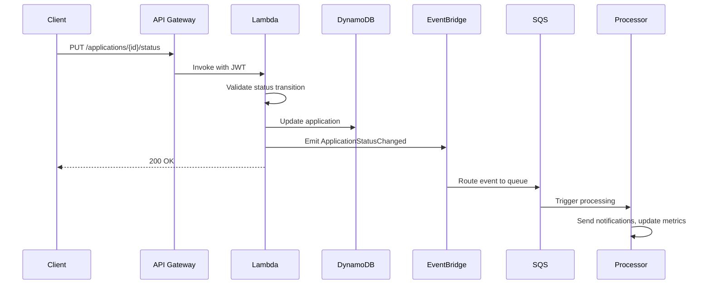

# MortgageFlow

[](https://github.com/mariano-aguero/mortgage-platform/actions/workflows/ci.yml)
[](https://codecov.io/gh/mariano-aguero/mortgage-platform)
[](https://www.typescriptlang.org/)
[](https://react.dev/)
[](https://aws.amazon.com/)
[](https://www.terraform.io/)
[](LICENSE)

**Digital Mortgage Application Platform** - A modern, serverless mortgage lending platform that streamlines the loan application process for borrowers and loan officers.

## Overview

MortgageFlow solves the complexity of traditional mortgage applications by providing:

- **For Borrowers**: A simple, guided multi-step application process with real-time validation and status tracking
- **For Loan Officers**: A dashboard to review, approve, or request additional information on applications
- **For Operations**: Event-driven architecture enabling real-time notifications and async processing

Built with a serverless-first approach, the platform scales automatically and costs near-zero at low volumes.

---

## Architecture

```
┌─────────────────────────────────────────────────────────────────────────────────┐
│                              MortgageFlow Architecture                          │
└─────────────────────────────────────────────────────────────────────────────────┘

                                    ┌──────────────┐
                                    │   CloudFront │
                                    │     (CDN)    │
                                    └──────┬───────┘
                                           │
                                    ┌──────▼───────┐
                                    │      S3      │
                                    │  (Frontend)  │
                                    └──────────────┘
                                           │
┌──────────────┐                    ┌──────▼───────┐
│              │  Authentication    │              │
│   Cognito    │◄──────────────────►│    React     │
│  User Pool   │    (JWT Tokens)    │   Frontend   │
│              │                    │              │
└──────────────┘                    └──────┬───────┘
                                           │
                                           │ HTTPS (REST API)
                                           │
                                    ┌──────▼───────┐
                                    │ API Gateway  │
                                    │   (REST)     │
                                    └──────┬───────┘
                                           │
                          ┌────────────────┼────────────────┐
                          │                │                │
                   ┌──────▼─────┐   ┌──────▼─────┐   ┌──────▼─────┐
                   │   Lambda   │   │   Lambda   │   │   Lambda   │
                   │  (Create)  │   │   (List)   │   │  (Update)  │
                   └──────┬─────┘   └──────┬─────┘   └──────┬─────┘
                          │                │                │
                          └────────────────┼────────────────┘
                                           │
                    ┌──────────────────────┼──────────────────────┐
                    │                      │                      │
             ┌──────▼───────┐       ┌──────▼───────┐       ┌──────▼───────┐
             │   DynamoDB   │       │ EventBridge  │       │      S3      │
             │ (Single Table)│       │  (Events)    │       │ (Documents)  │
             └──────────────┘       └──────┬───────┘       └──────────────┘
                                           │
                                    ┌──────▼───────┐
                                    │     SQS      │
                                    │   (Queue)    │
                                    └──────┬───────┘
                                           │
                                    ┌──────▼───────┐
                                    │   Lambda     │
                                    │ (Processor)  │
                                    └──────────────┘
```

### Event Flow (Status Changes)



---

## Tech Stack

### Frontend
[](https://react.dev/)
[](https://www.typescriptlang.org/)
[](https://tailwindcss.com/)
[](https://vitejs.dev/)
[](https://tanstack.com/query)

### Backend
[](https://nodejs.org/)
[](https://aws.amazon.com/lambda/)
[](https://www.serverless.com/)
[](https://zod.dev/)

### Database & Storage
[](https://aws.amazon.com/dynamodb/)
[](https://aws.amazon.com/s3/)

### Authentication
[](https://aws.amazon.com/cognito/)

### Infrastructure
[](https://www.terraform.io/)
[](https://aws.amazon.com/eventbridge/)
[](https://aws.amazon.com/sqs/)

### Testing
[](https://jestjs.io/)
[](https://vitest.dev/)
[](https://testing-library.com/)

---

## Getting Started

### Prerequisites

| Tool | Version | Installation |
|------|---------|--------------|
| Node.js | 20.x | [Download](https://nodejs.org/) or `nvm install 20` |
| pnpm | 8.x | `npm install -g pnpm` |
| AWS CLI | 2.x | [Install Guide](https://docs.aws.amazon.com/cli/latest/userguide/getting-started-install.html) |
| Terraform | 1.5+ | [Download](https://www.terraform.io/downloads) |
| Docker | 24+ | [Download](https://www.docker.com/products/docker-desktop/) (for local dev) |

### Quick Start (Local Development)

```bash
# 1. Clone the repository
git clone https://github.com/mariano-aguero/mortgage-platform.git
cd mortgage-platform

# 2. Install dependencies (installs all packages)
make install

# 3. Start LocalStack and initialize resources
make dev-local

# 4. In a new terminal, start the backend
make dev

# 5. In another terminal, start the frontend
make dev-web

# 6. Open http://localhost:5173
```

For detailed local development instructions, see [LOCAL_DEVELOPMENT.md](LOCAL_DEVELOPMENT.md).

**Test Credentials:**
| Role | Email | Password |
|------|-------|----------|
| Regular User | testuser@example.com | TestUser123! |
| Loan Officer | loanoffice@example.com | LoanOfficer123! |
| Admin | admin@example.com | AdminUser123! |

### Cloud Deployment

```bash
# 1. Configure AWS credentials
aws configure

# 2. Deploy infrastructure (creates DynamoDB, Cognito, S3, etc.)
make infra-apply STAGE=dev

# 3. Generate environment files from Terraform outputs
make setup-env STAGE=dev

# 4. Deploy backend (Lambda functions)
make deploy-dev

# 5. Build and deploy frontend
make build-web
# Then sync to S3/CloudFront (see Makefile for details)

# 6. Seed test data (optional)
make seed-data STAGE=dev
```

### Environment Variables

This monorepo uses **per-package environment variables** for better isolation:

```
mortgage-platform/
├── packages/
│   ├── api/
│   │   ├── .env.local      # Local development
│   │   ├── .env.dev        # Development (AWS)
│   │   ├── .env.staging    # Staging (AWS)
│   │   └── .env.example    # Template
│   │
│   └── web/
│       ├── .env.local      # Local development
│       ├── .env.dev        # Development (AWS)
│       └── .env.example    # Template
```

#### API Package (`packages/api/.env.local`)
```bash
# AWS Configuration
AWS_REGION=us-east-1
LOCALSTACK_ENDPOINT=http://localhost:4566
AWS_ACCESS_KEY_ID=test
AWS_SECRET_ACCESS_KEY=test

# DynamoDB
DYNAMODB_TABLE=mortgage-platform-local-applications

# S3
S3_BUCKET_DOCUMENTS=mortgage-platform-local-documents

# SQS
SQS_QUEUE_URL=http://localhost:4566/000000000000/mortgage-platform-local-queue
SQS_QUEUE_ARN=arn:aws:sqs:us-east-1:000000000000:mortgage-platform-local-queue

# EventBridge
EVENT_BUS_NAME=mortgage-platform-local-events

# Cognito
COGNITO_USER_POOL_ID=us-east-1_local
COGNITO_APP_CLIENT_ID=local_client
COGNITO_USER_POOL_ARN=arn:aws:cognito-idp:us-east-1:000000000000:userpool/us-east-1_local

# Webhooks
WEBHOOK_SECRET=local-webhook-secret-for-testing
```

#### Web Package (`packages/web/.env.local`)
```bash
# API URL (Serverless Offline for local, API Gateway for AWS)
VITE_API_URL=http://localhost:3000

# AWS Configuration
VITE_AWS_REGION=us-east-1

# Cognito
VITE_COGNITO_USER_POOL_ID=us-east-1_local
VITE_COGNITO_APP_CLIENT_ID=local_client
VITE_COGNITO_REGION=us-east-1

# Environment
VITE_ENVIRONMENT=local
```

> **Note**: For AWS deployments (dev/staging/prod), the API reads configuration from SSM Parameter Store. Environment files are only needed for local development.

---

## Architecture Decisions

### 1. Single-Table Design (DynamoDB)

**Decision**: Use a single DynamoDB table with composite keys instead of multiple tables.

**Rationale**:
- **Cost Efficiency**: One table means one set of provisioned capacity or on-demand billing
- **Atomic Operations**: Related data can be updated in single transactions
- **Access Patterns**: Our access patterns (get by ID, list by user, filter by status) map well to GSIs
- **Scalability**: DynamoDB scales horizontally without schema migrations

**Key Schema**:
```
PK: APP#<applicationId>     SK: METADATA          → Application data
PK: APP#<applicationId>     SK: HISTORY#<date>    → Status history
GSI1PK: USER#<userId>       GSI1SK: APP#<appId>   → User's applications
GSI2PK: STATUS#<status>     GSI2SK: <createdAt>   → Applications by status
```

### 2. EventBridge + SQS for Async Processing

**Decision**: Use EventBridge for event routing and SQS for reliable processing.

**Rationale**:
- **Decoupling**: Lambda functions don't need to know about downstream consumers
- **Reliability**: SQS provides at-least-once delivery with DLQ for failed messages
- **Scalability**: EventBridge handles high throughput; SQS provides backpressure
- **Extensibility**: New consumers can subscribe to events without modifying producers
- **Cost**: EventBridge is $1/million events; SQS is $0.40/million requests

**Event Flow**:
```
Lambda → EventBridge (publish) → Rule matches → SQS (buffer) → Lambda (process)
                              ↘ Rule matches → SNS (future: notifications)
```

### 3. Serverless Framework for Lambda (vs Terraform-only)

**Decision**: Use Serverless Framework for Lambda functions while using Terraform for base infrastructure.

**Rationale**:
- **Developer Experience**: Serverless Framework excels at Lambda deployments with `sls deploy`
- **Local Development**: `serverless-offline` provides excellent local API Gateway emulation
- **Bundling**: Built-in esbuild support for TypeScript compilation and tree-shaking
- **IAM**: Auto-generates minimal IAM policies based on resource references
- **Separation of Concerns**: Terraform manages long-lived infra; Serverless manages code

**Hybrid Approach**:
```
Terraform → DynamoDB, Cognito, S3, SQS, EventBridge (long-lived)
Serverless → Lambda functions, API Gateway (frequently deployed)
```

### 4. Status Transition Validation

**Decision**: Implement a state machine pattern with explicit valid transitions.

**Rationale**:
- **Data Integrity**: Prevents invalid state changes (e.g., APPROVED → DRAFT)
- **Audit Trail**: Every transition is logged with timestamp and actor
- **Business Rules**: Transitions can require specific conditions (e.g., only loan officers can approve)

**Valid Transitions**:
```
DRAFT → SUBMITTED (by borrower)
SUBMITTED → UNDER_REVIEW (by loan officer)
UNDER_REVIEW → APPROVED | REJECTED | ADDITIONAL_INFO_REQUIRED (by loan officer)
ADDITIONAL_INFO_REQUIRED → SUBMITTED (by borrower)
APPROVED → CLOSED | WITHDRAWN (by system/borrower)
```

---

## API Documentation

### Base URL
- **Local**: `http://localhost:3000`
- **Dev**: `https://<api-id>.execute-api.us-east-1.amazonaws.com/dev`
- **Prod**: `https://<api-id>.execute-api.us-east-1.amazonaws.com/prod`

### Authentication
All endpoints (except health check) require a valid JWT token in the `Authorization` header:
```
Authorization: Bearer <cognito-id-token>
```

### Endpoints

| Method | Path | Auth | Description |
|--------|------|------|-------------|
| `GET` | `/health` | No | Health check |
| `POST` | `/applications` | Yes | Create new application |
| `GET` | `/applications` | Yes | List user's applications |
| `GET` | `/applications/{id}` | Yes | Get application by ID |
| `PUT` | `/applications/{id}` | Yes | Update application |
| `PUT` | `/applications/{id}/status` | Yes | Update application status |
| `DELETE` | `/applications/{id}` | Yes | Delete draft application |
| `GET` | `/applications/{id}/history` | Yes | Get status history |
| `POST` | `/applications/{id}/documents` | Yes | Get presigned upload URL |

### Example: Create Application

**Request**:
```bash
curl -X POST https://api.example.com/dev/applications \
  -H "Authorization: Bearer <token>" \
  -H "Content-Type: application/json" \
  -d '{
    "borrowerInfo": {
      "firstName": "John",
      "lastName": "Doe",
      "email": "john.doe@example.com",
      "phone": "(555) 123-4567",
      "ssnLast4": "1234",
      "annualIncome": 85000,
      "employmentStatus": "Employed",
      "employer": "Acme Corp"
    },
    "propertyInfo": {
      "address": "123 Main St, New York, NY 10001",
      "type": "Single Family",
      "estimatedValue": 450000,
      "loanAmount": 360000,
      "loanType": "Conventional",
      "downPaymentPercentage": 20
    }
  }'
```

**Response** (201 Created):
```json
{
  "success": true,
  "data": {
    "applicationId": "app-a1b2c3d4-e5f6-7890-abcd-ef1234567890",
    "status": "DRAFT",
    "borrowerInfo": {
      "firstName": "John",
      "lastName": "Doe",
      "email": "john.doe@example.com",
      "phone": "(555) 123-4567",
      "ssnLast4": "1234",
      "annualIncome": 85000,
      "employmentStatus": "Employed",
      "employer": "Acme Corp"
    },
    "propertyInfo": {
      "address": "123 Main St, New York, NY 10001",
      "type": "Single Family",
      "estimatedValue": 450000,
      "loanAmount": 360000,
      "loanType": "Conventional",
      "downPaymentPercentage": 20
    },
    "createdAt": "2024-01-15T10:30:00.000Z",
    "updatedAt": "2024-01-15T10:30:00.000Z"
  }
}
```

**Error Response** (400 Bad Request):
```json
{
  "success": false,
  "error": {
    "code": "VALIDATION_ERROR",
    "message": "Invalid request body",
    "details": [
      {
        "path": ["borrowerInfo", "email"],
        "message": "Invalid email format"
      }
    ]
  }
}
```

---

## Testing

### Run All Tests

```bash
# All tests (API + Web)
make test

# API tests only
make test-api

# Web tests only
make test-web
```

### Run with Coverage

```bash
# All packages
make test-coverage

# Individual packages
cd packages/api && pnpm test:coverage
cd packages/web && pnpm test:coverage
```

### Coverage Report

```
-----------------------------|---------|----------|---------|---------|
File                         | % Stmts | % Branch | % Funcs | % Lines |
-----------------------------|---------|----------|---------|---------|
All files                    |   87.5  |   82.3   |   91.2  |   88.1  |
 src/handlers                |   92.1  |   88.5   |   95.0  |   92.8  |
 src/services                |   85.3  |   78.9   |   88.2  |   86.0  |
 src/utils                   |   95.0  |   90.0   |   100   |   95.5  |
-----------------------------|---------|----------|---------|---------|
```

### Test Structure

```
packages/
├── api/src/                    # Backend tests (colocated)
│   ├── handlers/
│   │   ├── applications/
│   │   │   └── *.test.ts
│   │   ├── processors/
│   │   │   └── *.test.ts
│   │   └── webhooks/
│   │       └── *.test.ts
│   ├── services/
│   │   └── *.test.ts
│   └── utils/
│       └── *.test.ts
│
└── web/src/                    # Frontend tests
    ├── components/
    │   └── __tests__/
    ├── pages/
    │   └── __tests__/
    └── hooks/
        └── __tests__/
```

---

## Deployment

### Full Deployment (All Stages)

```bash
# Development
make deploy-all STAGE=dev

# Staging
make deploy-all STAGE=staging

# Production (requires manual approval)
make deploy-all STAGE=prod
```

### Individual Components

```bash
# Infrastructure only
make infra-apply STAGE=dev

# Backend only
make deploy-dev

# Frontend only
make build-web
```

### Rollback

```bash
# Rollback backend to previous version
pnpm sls rollback --stage dev

# Rollback infrastructure (careful!)
cd infrastructure/environments/dev
terraform plan   # Review changes
terraform apply
```

### Cost Estimation

| Resource | Free Tier | Beyond Free Tier | Estimated Monthly |
|----------|-----------|------------------|-------------------|
| **Lambda** | 1M requests, 400K GB-sec | $0.20/1M requests | $0.00 - $0.50 |
| **API Gateway** | 1M requests | $3.50/1M requests | $0.00 - $1.00 |
| **DynamoDB** | 25 GB, 25 WCU/RCU | $1.25/WCU, $0.25/RCU | $0.00 - $0.50 |
| **S3** | 5 GB, 20K GET, 2K PUT | $0.023/GB | $0.00 - $0.10 |
| **Cognito** | 50K MAU | $0.0055/MAU | $0.00 |
| **EventBridge** | None | $1.00/1M events | $0.00 - $0.10 |
| **SQS** | 1M requests | $0.40/1M requests | $0.00 |
| **CloudWatch** | 5 GB logs | $0.50/GB | $0.00 - $0.50 |
| | | **Total** | **$0 - $3/month** |

> **Note**: For a low-traffic development/staging environment, costs should remain within AWS Free Tier. Production costs depend on usage but the serverless architecture ensures you only pay for what you use.

---

## Future Improvements

### Phase 2: Document Management
- [ ] Document upload with S3 presigned URLs
- [ ] Document type validation (PDF, images)
- [ ] Virus scanning with S3 Object Lambda
- [ ] Document versioning and audit trail

### Phase 3: Notifications
- [ ] Email notifications via Amazon SES
- [ ] SMS notifications via Amazon SNS
- [ ] In-app notification center
- [ ] Notification preferences per user

### Phase 4: Integrations
- [ ] Credit check integration (Experian, TransUnion, Equifax)
- [ ] Property valuation API (Zillow, CoreLogic)
- [ ] Income verification (Plaid, Finicity)
- [ ] E-signature integration (DocuSign, HelloSign)

### Phase 5: Analytics & Reporting
- [ ] Reporting dashboard with Amazon QuickSight
- [ ] Data warehouse with Redshift or Athena
- [ ] Real-time metrics with CloudWatch dashboards
- [ ] Conversion funnel analytics

### Phase 6: DevOps
- [ ] CI/CD pipeline with GitHub Actions
- [ ] Automated testing in pipeline
- [ ] Blue/green deployments
- [ ] Feature flags with AWS AppConfig
- [ ] Automated security scanning (Snyk, Dependabot)

### Phase 7: Compliance & Security
- [ ] SOC 2 compliance documentation
- [ ] Data encryption at rest and in transit (KMS)
- [ ] VPC deployment for Lambda
- [ ] WAF rules for API Gateway
- [ ] Audit logging with CloudTrail

---

## Project Structure

This is a **pnpm monorepo** with three packages:

```
mortgage-platform/
├── packages/
│   ├── shared/                 # Shared types and schemas
│   │   ├── src/
│   │   │   ├── types.ts        # TypeScript interfaces & enums
│   │   │   ├── schemas.ts      # Zod validation schemas
│   │   │   └── index.ts        # Public exports
│   │   ├── package.json
│   │   └── tsup.config.ts      # Build configuration
│   │
│   ├── api/                    # Backend API (Serverless)
│   │   ├── src/
│   │   │   ├── handlers/       # Lambda handler functions
│   │   │   ├── services/       # Business logic
│   │   │   ├── models/         # Data models
│   │   │   └── utils/          # Utilities
│   │   ├── .env.example        # Environment template
│   │   ├── serverless.yml      # Serverless config
│   │   └── package.json
│   │
│   └── web/                    # Frontend (React + Vite)
│       ├── src/
│       │   ├── components/     # React components
│       │   ├── pages/          # Page components
│       │   ├── hooks/          # Custom hooks
│       │   ├── services/       # API client
│       │   └── context/        # React context
│       ├── .env.example        # Environment template
│       └── package.json
│
├── infrastructure/             # Terraform IaC
│   ├── modules/
│   │   └── core/               # Core AWS resources
│   └── environments/
│       ├── dev/
│       ├── staging/
│       ├── prod/
│       └── local/              # LocalStack config
│
├── scripts/                    # Deployment scripts
│   ├── init-localstack.sh      # Initialize LocalStack
│   ├── setup-env.sh            # Generate .env files
│   └── seed-data.sh            # Seed test data
│
├── docker-compose.yml          # LocalStack container
├── Makefile                    # Build automation
├── pnpm-workspace.yaml         # Monorepo config
├── package.json                # Root workspace
├── tsconfig.json               # TypeScript references
├── LICENSE                     # MIT License
└── README.md                   # This file
```

### Package Dependencies

```
@mortgage-platform/shared
         ↑
    ┌────┴────┐
    │         │
@mortgage-platform/api   @mortgage-platform/web
```

---

## Contributing

1. Fork the repository
2. Create a feature branch (`git checkout -b feature/amazing-feature`)
3. Make your changes
4. Run tests (`make test`)
5. Commit your changes (`git commit -m 'Add amazing feature'`)
6. Push to the branch (`git push origin feature/amazing-feature`)
7. Open a Pull Request

### Code Style

- Follow the existing code style (enforced by ESLint and Prettier)
- Write tests for new features
- Update documentation as needed
- Keep commits atomic and well-described

---

## License

This project is licensed under the MIT License - see the [LICENSE](LICENSE) file for details.

---

## Support

- **Issues**: [GitHub Issues](https://github.com/mariano-aguero/mortgage-platform/issues)
- **Discussions**: [GitHub Discussions](https://github.com/mariano-aguero/mortgage-platform/discussions)

---

<p align="center">
  Built with serverless architecture on AWS
</p>
